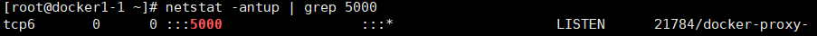

# Docker

## 1.部署docker容器虚拟化平台

#### 	1.1 修改yum源文件

```shell
mv /etc/yum.repos.d/* /opt
wget -O /etc/yum.repos.d/CentOS-Base.repo http://mirrors.aliyun.com/repo/Centos-7.repo
vi /etc/docker/daemon.json
	{
  "registry-mirrors": [
  "https://mirror.iscas.ac.cn",
  "https://docker.rainbond.cc",
  "https://ccr.ccs.tencentyun.com"
  	 ]
	}

#重新加载守护进程
systemctl daemon-reload
```


#### 	1.2 安装Docker

```shell
yum -y install docker
```


#### 	1.3 启动Docker平台

```shell
# 启动Docker服务
	systemctl start docker

# 设置开机启动Docker服务
 	systemctl enable docker

# 显示Docker版本信息
	docker version

# 查看Docker信息 (确认服务运行)显示Docker系统信息,包括镜像和容器数。
	docker info
```


#### 	1.4 下载Docker镜像

```shell
# 下载镜像
	docker pull hub.c.163.com/library/tomcat:latest

# 查看images列表
	docker images
```


#### 	1.5 开启动网络转发功能

```shell
# 开启动网络转发功能,默认会自动开启
'0 表示IP转发功能被禁用。这意味着系统不会讲收到的数据包转发到其他网络接口'
'1 表示IP转发功能被启用。这意味系统会将收到的数据包转发到其他网络接口，这在路由和NAT（网络地址转换）登等场景下非常有用。'
# 手动开启：
	vim /etc/sysctl.conf	'插入以下内容'
		net.ipv4.ip_forward  = 1

	sysctl -p '生效'

# 查看转发功能的启用状态
	cat /proc/sys/net/ipv4/ip_forward
```


#### 	1.6 Docker平台基本使用方法

- run

  ```shell
  # 启动一个实例
  	-i	'以交互模式运行容器'
  	-t	'为容器重新分配一个伪输入终端'
  
  	docker run -it $images:$tag /bin/bash
  
  # 查看实例环境
  	cat /etc/redhat-release
  
  # 退出容器
  	exit
  
  # 在container中启动一个长久运行的进程,不断向stdin输出 hello world。模拟一个后台运行的服务
  	-d '后台运行容器,并返回容器ID'
  	-c '后面跟待完成的命令'
  
  	docker run -d $images:$tag /bin/sh -c "while true;do echo hello world;sleep 1;done"
  ```

- logs

  `docker logs $ID` <!--ID可以不写全,只要唯一就行-->

- ​	ps

  ```shell
  # 列出所有运行中的容器
  	docker ps 
  
  # 列出所有容器 (包含沉睡/退出状态的容器)
  	docker ps  -a
  ```

- kill
  `docker kill $ID`

   - 启动、停止、重启 container容器实例

     ```shell
       启动：run # 创建并运行docker实例
       	docker run -d $images:$tag /bin/sh -c "while true;do echo hello world;sleep 1;done"
     
       # 关闭容器
       	docker stop $ID
     
       # 开启容器
       	docker start $ID
     ```

   - rm
     `docker rm -rf $ID` **<!-- -rf 强制删除不管容器是否开启-->**
     扩展：删除所有容器
     `docker container prune -f` **<!--删除所有停止的容器-->**
     `docker rm -f $(docker ps -aq)` **<!--停止并删除所有正在运行的容器-->**

     ​	解释： `docker ps -ap` **<!--列出所有容器的ID，包括正在运行和已停止的容器-->**


#### 	1.7 镜像制作方法

 - 方法一
   ==**创建一个安装好apache工具的容器镜像**==

   ​	[解决容器无法使用yum](Docker常见问题/容器yum失败.txt)

   ```shell
   #根据容器当前状态做一个image镜像：创建一个安装了apache工具的centos镜像
   	语法:docker commit <container$ID>/<image_name$ID> $name:$tag
   
   #使用新创建的镜像,生成一台容器实例
       doceker run -it $images:$tag /bin/bash
   
   #查看已经安装好的apache命令
   	rpm -qa httpd
   ```

 - 方法二

   ==**创建一个基于centos的httpd web服务器镜像**==

   1. 创建工作目录

      ```shell
      'make 自动化编译时需要Makefile文件,自动化创建Docker镜像时,需要Dockerfile'
      mkdir /docker-build
      cd /docker-build
      touch Dockerfile
      ```

   2. 编辑Dockerfile

      ```dockerfile
      'Dockerfile 用来创建一个自定义的image,包含了用户指定的软件依赖等'
      # vim Dockerfile
      	FROM docker.io/centos:latest '基于哪个镜像'
      	MAINTAINER <mk@xuegod.cn>	'镜像创建者'
      	RUN yum -y install httpd	'安装软件应用'
      	ADD start.sh /usr/local/bin/start.sh
      	ADD index.html /var/www/html/index.html
      
      如：dockefile1 中的内容如下：
      # vim dockefile1
      	FROM ubuntu
      	MAINTAINER xxx
      	RUN echo hello1 > test1.txt
      	RUN echo hello2 > /test2.txt
      	EXPOSE 80
      	EXPOSE 81
      	CMD ["/bin/bash"]
      ```

   3. 创建start.sh脚本启动httpd服务和apache默认首页index.html文件

      ```shell
      echo "/usr/sbin/httpd-DFOREGROUND" > start.sh '相当于执行了 systemctl start httpd'
      chmod a+x start.sh
      
      #创建index.html
      	echo "docker images build test" > index.html
      ```

   4. 使用命令build来创建新的image

      ```shell
      docker build -t $images:$tag Dockerfile $path '-t:表示tage,镜像名'
      
      ```

#### 	1.8 Docker Imaage 的发布


  - 方法一：Save Image To TarBall

    ​	==**保存Image到tar包**==

    ​	`docker save -o $导出的镜像名.tar $本地镜像名:$tag `

    

    ​	==**EG：使用导入本地镜像**==

    ```shell
    # 删除镜像，这里写自己镜像的ID或名字
    docker rmi docker.io/centos:httpd
    docker load -i centos-httpd-docker-image.tar
    ```


  - 方法二：Push Image To Docker Hub 发布到外网

    ```shell
    # 注册一个账号
    1、Signup on docker hub & create repo
    https://hub.docker.com/
    
    2、Login to docker hub 
    docker login -u userabc -p abc123 -e userab@gmail.com
    
    # 上传镜像
    3、Push image to docker hub 
    docker push centos:httpd
    
    # 下载镜像
    4、Pull image from docker hub 
    docker pull userabc/centos:httpd $用户名/镜像名
    ```


8. Container容器端口映射

  - Container 端口映射

    ```shell
    # 启动 container
    docker run -d -p 80:80 $image:$tag /bin/bash -c /usr/local/bin/start.sh
    '-p 物理机的80端口:容器实例的80端口,把容器中的80端口映射到物理机上的80端口'
    
    # 物理机上查容易状态
    docker ps
    
    # 查看物理机上开启的80代理端口
    netstat -antup | grep 80
    ```


  - 访问正在运行的container容器实例

    语法：`docker exec -it $<container id | name> /bin/bash`

    ```shell
    # 查看正在运行的容器ID
    docker ps 
    
    # 进入容器
    docker exec -it $ID /bin/bash
    
    # 创建html文件
    echo $txt > $path.html
    
    # 查看新添加的html文件
    curl http://$IP/$name.html
    ```


## 2.docker容器命名和资源配额控制

#### 		2.1 容器命名和重命名

​	命名：`docker run -d --name 容器实例名 容器镜像名 要执行的命令`
​	重命名：`docker rename 旧容器名 新容器名` 

#### 	2.2 指定创建容器主机名

​	语法：`docker run -it --name $容器名 -h 指定主机名 镜像 /bin/bash`

#### 	2.3 容器CPU资源配额控制

##### 	2.3.1 容器资源配额控制

​	==**给容器实例分配512权重的cpu使用份额**==

​	参数：`--cpu-shares 512`

```shell
docker run -it --cpu-shares 512 centos /bin/bash

#查看结果
cat /sys/fs/cgroup/cpu/cpu.shares
```

##### 	2.3.2 CPU周期控制

​	==**指定周期**==

​		`--cpu-period`  <!--最小值为1000us,最大值为1s,默认值为0.1s-->
​	<!--用来指定容器对CPU的使用要在多长时间内做一次重新分配-->

​	==**指定在这个周期中使用多少时间片**==
​		`--cpu-quota`  <!--默认值为-1，表示不做控制-->
​	<!--用来指定在这个周期内，最多可以有多少时间片断用来跑这个容器-->

​	==**查看**==
​		`cat /sys/fs/cgroup/cpu/cpu.cfs_period_us`

##### 	2.3.3 CPU core 核心控制

​	`--cpuset` <!--绑定CPU-->

​	服务架构

- SMP
  对称多处理器结构 EG：x86服务器，双路服务器。主板上有两处理cpu
- NUMA
  非一致存储访问结构 EG：IBM小型机 pSeries 690
- MPP
  海量并行处理结构 EG：大型机

##### 	2.3.4CPU亲和力

​	taskset设定cpu亲和力，能够将一个或多个进程绑定到一个或多个处理器上运行。

​	参数：

​	`-c,--cpu-list`	<!--以列表格式显示和指定CPU-->

​	`-p,--pid`			 <!--在已经存在的pid上操作-->


​	==**EG1：设置只在1和2号cpu运行sshd进程程序**==

   ```shell
ps -axu | grep sshd
taskset -cp 1,2 $process 'affinity -密切关系'
   ```

​	**==EG2：查看ID为1的进程在哪个cpu上运行==**

   ```shell
taskset -cp 1 
'RHEL6中进程ID为1的进程是：init'
'RHEL7中进程ID为1的进程是：systemd'
   ```

​	==**EG3：设置nginx cpu亲和力**==

​		在 conf/nginx.conf 中，有如下一行：

   ​		**worker_processes 1;**

   ​	这是用来配置nginx启劢几个工作迚程的，默认为 1。而 nginx还支持一个名为worker_cpu_affinity

   ​	的配置项，也就是说，nginx 可以为每个工作迚程绑定 CPU。如下配置：

   ​		**worker_processes 4;**

   **​		worker_cpu_affinity 0001 0010 0100 1000;**

   ​	这里 0001 0010 0100 1000 是掩码，分别代表第 1、2、3、4 颗 cpu 核心。

   ​	重启 nginx 后，4 个工作迚程就可以各自用各自的 CPU 了。

   ==**EG4：物理机一共有16个核心，创建的容器只能用0、1、2这三个核心**==

   ```shell
docker run -it --name cpu1 --cpuset-cpus 0-2 centos
cat /sys/fs/cgroup/cpuset/cpuset.cpus
taskset -cp 1
   ```

##### 	2.3.5 CPU配额控制参数

> ==**Stree命令**==
>
> ​	概述：linux系统压力测试软件 Stress。stress可以测试Linux系统cpu/memory/IO/disk 的负载。
>
> ​		下载页： `http:people.seas.harvard.edu/~apw/stress/`
>
> ​	使用epel源中的stress-xxx.rpm，源码编译通用版本：
>
> - 方法一：
>
>   ```shell
>   yum install -y epel-release
>   yun install stress -y
>   ```
>
> 
>
> - 方法二：
>
>   ```shell
>   # 安装 stress，进行压力测试
>   # 上传 stress到Linux系统中。
>   tar zxvf stress-1.0.4.gz
>   cd stress-1.0.4/
>   ./configure
>   make -j 4
>   make install 
>   
>   EG:产生2个cpu进程，2个io进程，20秒后停止运行
>   stress -c 2 -i 2 --verbose --timeout 20s '改为分钟1m'
>   ```

##### 	2.3.6 测试cpuset-cpus 和 cpu-shares 混合使用运行效果

> ​	==**创建两个容器实例**==
>
> ```shell
> 	docker run -itd --name docker10 --cpuset-cpus 0,1 --cpu-shares 512 centos /bin/bash
> 	docker run -itd --name docker20 --cpuset-cpus 0,1 --cpuset-shares 1024 centos /bin/bash
> ```
>
> - 测试1：进入 docker10，使用测试进程是不是只在cpu 0,1上运行：
>
>   ```shell
>    docker exec -it docker10 /bin/bash
>    yum install -y epel-release
>    yum install stress -y
>   
>    # 在物理机上使用 top 按 1 快捷键查看，每个 cpu 使用情况：
>   ```
>
> - 测试2：进入 docker20,使用stress测试进程是不是只在 cpu 0,1上运行,且 dockers20上运行的 stress使用 cpu 百分比是dockers10 的 ==2**倍**==
>
>   ```shell
>    docker exec -it docker20 /bin/bash
>    yum install -y epel-release
>    yum install stress -y
>    stree -c 2 -v -t 10m
>   
>    # 在物理机上使用 top 按 1 快捷键查看，每个 cpu 使用情况：
>   ```
>
>   注：<!--两个容器只在cpu0,1上运行。且docker20是docker10使用cpu的2倍。说明限制资源成功。-->

##### 2.3.7 当容器命令运行结束后，自动删除容器

> `--rm`当容器命令运行结束后，自动删除容器，自动释放资源
>
> ==**作用:**== 当容器命令运行结束后，自动删除容器。
>
> ==**应用场景：**== 在某些环境下，可能需要大量的新建 docker 实例，然后仅仅运行几秒钟，然后就彻底删除。如运行单元测试或测试弹性云计算。
>
> Eg：阿里云，要模拟双11的压力，需要快速创建1万实例，运行 ab 命令，拼命访问 tmall.com 首页，运行1个小时，1小时后自动删除。
>
> ```shell
> docekr run -it --rm --name mk $image sleep 5
> docker ps | grep mk 
> # 5秒后查看 自动删除
> ```

#### 2.4 容器内存资源配额控制

参数：`-m` ,`--memory=""`限制容器的内存使用量

EG：允许容器使用的内存上限为 128 M：

```shell
docker run -it -m 128m centos

# 查看
cat /sys/fs/cgroup/memory/memory.limit_in_bytes
	134217728
"注：也可以使用 tress 进行测试 也可以使用 | awk '{print $1/1024/1024 "MB"}' 进行单位换算"
```

#### 2.5 容器IO资源配额控制

`--device-write-bps value`	**<!--限制此设备上的写速度，单位可以是kb、mb或者gb-->**

`--device-read-bps value`	 **<!--限制此设备上的读速度，单位可以是kb、mb或者gb-->**

情景：防止某个 Docker 容器吃光你的磁盘 I/O 资源

​	EG：容器对磁盘的最高写入速度设定为 1MB/s。

​	`--device` 参数：将主机设备添加到容器

```shell
docker run -it -v /var/www/html/:/var/www/html --device /dev/sda:/dev/sda --device-write-bps /dev/sda:1mb $image /bin/bash

time dd if=/dev/sda of=/var/www/html/test.out bs=1M count=50 oflag=direct,nonblock
```

**<!-- 
	dd 参数：
	direct：读写数据采用直接 IO 方式；
	nonblock：读写数据采用非阻塞 IO 方式
-->**

​	**<font color= 'Apricot'>查看结果：</font>**

```shell
ll -h var/www/html/
```

**<!--发现1秒写1M。限制成功-->**

#### 2.6 docker 数据映射

语法：`docker run -itd -v /src:/dst centos bash`	
**<!-- -v 用来指定挂载目录 ”:“前面的/src为物理机本地目录，后面的/dst为容器里的目录 -->**
EG：把物理机上的/var/www/html 映射到 docker 实例的/var/www/html。
好处：当 docker 坏了，数据还在物理机上，再使用 apache 镜像启动一个 docker 就可以了。数据不丢失。

```shell
mkdir -p /var/www/html 
doceker run -it --name web1 -v /var/www/html/:/var/www/html $image bash
touch /var/www/html/index.html

# 物理机查看
ls /var/www/html/
```

## 3. 配置docker静态IP地址-配置docker私有仓库

#### 3.1创建docker静态化IP

##### 	3.1.1 配置桥接网络

​	安装：`rpm -ivh /mnt/Packages/bridge-utils-1.5-9.el7.x86_64.rpm`

```shell
# 把 eth0 绑到 br0 桥设备上
vi /etc/sysconfig/network-scripts/ifcfg-ens32
# 删除以下内容
	IPADDR="192.168.100.50"
	PREFIX="24"
	GATEWAY="192.168.1.1"
	DNS1="8.8.8.8"
# 插入
	BRIDGE="br0"

# 生成桥设备 br0 的配置文件
vi /etc/sysconfig/network-scripts/ifcfg-br0
	DEVICE="br0"
	NM_CONTROLLED="yes"
	ONBOOT="yes"
	TYPE="Bridge"
	BOOTPROTO=none
	IPADDR=192.168.100.60
	NETMASK=255.255.255.0
	GATEWAY=192.168.100.1
	DNS1=8.8.8.8

# 重启服务
service network restart
```

##### 3.1.2 下载 pipework 包

​	上传压缩包：
​	[pipework-master.zip](压缩包\pipework-master.zip)
​	[centos-latest-docker-image.tar](压缩包/centos-latest-docker-image.tar)

```shell
unzip pipework-master.zip
cp /root/pipework-master/pipework /usr/local/bin/ "方便后期使用 pipework 命令"

# 上传镜像到Linux,并导入docker平台
docker load -i centos-latest-docker-image.tar
```

##### 3.1.3 使用静态 IP 启动一个 docker 实例

`--privileged=true`	**<!--允许开启特权模式-->**

```shell
给容器配置地址
`pipework $网桥名 $实例ID $IP/掩码@网关`

# 安装 ifconfig 命令
yum install -y net-tools

# 查看网路路由情况
route -n
```

##### 3.1.4 使用静态 IP 启动一个 web 服务器

```shell
# 进入到容器
yum install httpd -y

# 直接运行 httpd 命令
httpd

neststat -antup | grep 80 "发现80已经监听"
cd /var/www/html/
echo aaaaa > index.html
```

#### 3.2 创建 docker 私有化仓库

**实验环境**

|        | docker 私有仓库地址 | docker 服务器地址 |
| :----: | :-----------------: | :---------------: |
| 用户名 |      Docker1-1      |     Docker1-2     |
|   IP   |   192.168.100.50    |  192.168.100.60   |

##### 3.2.1  配置 Docker1-1 为 docker 私有仓库

```shell
# 不能关闭防火墙，因为 docker 后期端口转发，需要使用 firewalld
systemctl start firewalld.service

# 关闭 selinux
vim /etc/sysconfig/selinux
改：SELINUX = enforcing
为：SELINUX = disabled
```

##### 3.2.2 配置 Docker1-1 私有仓库服务端

扩展：[BusyBox 概述](资料/BusyBox概述.docx)

上传压缩包：	
[registry.tar](压缩包\registry.tar)
[nusybox.tar](压缩包\busybox.tar)

```shell
# 启动docker 
systemctl start docker

# 拉取 registry 镜像
docker load -i registry.tar

# 拉取 busybox 镜像
docker load -i busybox.tar
```

3.2.3 修改 docker 配置文件，指定私有仓库 url
`registry`	记录，登记，注册

```shell
# 查看是否有 docker-common 包
rpm -qf /etc/sysconfig/docker 

vi /etc/sysconfig/docker
改：4 OPTIONS='--selinux-enabled --log-driver=journald --signature-verification=false'
为：OPTIONS='--selinux-enabled --log-driver=journald --signature-verification=false --insecure-registry 192.168.1.63:5000'

# 重启服务
systemctl restart docker 

# 推出镜像
docker push 192.168.100.50:5000/busybox
```

3.2.4 使用 registry 镜像搭建一个私有仓库

使用 `-v` 参数，指定本地持久的路径

`docker run -d -p 5000:5000 -v /opt/registry:/var/lib/registry registry`


说明，私有库已经启动成功

```shell
# 将刚打好标签的镜像，push到本地私有仓库中。
docker push 192.168.100.50:5000/busybox	"镜像前面一定要加上私有仓库的IP地址否则会自动匹配到dockhub中"

# 查看镜像的存储目录和文件 
rpm -ivh /mnt/Packages/tree-
```

