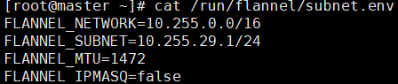

# k8s

 实验环境：需要四台全新的 Centos7.4 系统

|      |     Master      |      Etcd       |      Node1      |      Node2      |
| :--: | :-------------: | :-------------: | :-------------: | :-------------: |
|  IP  | 192.168.100.100 | 192.168.100.101 | 192.168.100.102 | 192.168.100.103 |
| CPU  |        4        |        4        |        4        |        4        |
| 内存 |        2        |        2        |        2        |        2        |
| 网卡 |      ens32      |      ens32      |      ens32      |      ens32      |

## 1. 搭建 Kubernetes 容器集群管理系统

#### 	1.1 配置 kubernetes 的 yum 源

​	上传压缩包 [k8s-package.tar.gz](压缩包/k8s-package.tar.gz)

​	**==所有节点==**

> ```shell
> tar zxvf k8s-package.tar.gz
> tee /etc/yum.repos.d/k8s-package.repo <<-'EOF'
> [k8s-package]
> name=k8s-package
> baseurl=file:///root/k8s-package
> enabled=1
> gpgcheck=0
> EOF
> ```
>
> ​	**<font color= 'Apricot'>配置本地镜像yum源</font>**
>
> ```shell
> mount /dev/cdrom /mnt/
> tee /etc/yum.repos.d/centos7.repo <<-'EOF'
> [centos7]
> name=CentOS7
> baseurl=file:///mnt
> enable=1
> gpgcheck=0
> gpgkey=file:///etc/pki/rpm-gpg/RPM-GPG-KEY-CentOS-7
> EOF
> 
> mv /etc/yum.repos.d/CentOS-* /opt/
> ```
>
> ​	**<font color= 'Apricot'>关闭防火墙</font>**
>
> ```shell
> systemctl stop firewalld && systemctl disable firewalld && systemctl status firewalld
> ```

#### 1.2 各节点上安装 k8s 组件

​	**==所有节点==**

```shell
vim /etc/hosts
192.168.100.100 master
192.168.100.101 etcd
192.168.100.102 node1
192.168.100.103 node2
```

​	**==Etcd 和 Master 节点==**

```shell
yum install -y kubernetes etcd flannel ntp
```

​	**==Node1 和 Node2 节点==**

```shell
yum install kubernetes flannel ntp -y
```

#### 1.3 配置 Etcd 和 Master 节点

##### 	**==Etcd 节点==**

> ```shell
> vim /etc/etcd/etcd.conf
> ```
>
> 改：2 ETCD_NAME=**default**
> 为：2 ETCD_NAME=**==<font color= 'Apricot'>"etcd"</font>**
> 改：9 ETCD_LISTEN_CLIENT_URLS="http://localhost:2379"
> 为：ETCD_LISTEN_CLIENT_URLS="http://localhost:2379**,http://192.168.100.100:2379**"
> 改：20 ETCD_ADVERTISE_CLIENT_URLS="http://localhost:2379"
> 为：ETCD_ADVERTISE_CLIENT_URLS="http://**<font color= 'Apricot'>192.168.100.100</font>**:2379"
>
> ​	**<font color= 'Apricot'>启动服务</font>**
>
> ```shell
> systemctl start etcd
> systemctl enable etcd
> systemctl status etcd
> ```
>
> ​	**<font color= 'Apricot'>查看</font>**
>
> ```shell
> netstat -antup | grep 2379
> ```
>
> 
>
> ​	**<font color= 'Apricot'>检查Etcd集群成员列表</font>**
>
> ```shell
> etcdctl member list
> ```
>
> 
>
> ​	**<font color= 'Apricot'>设置 etcd 网络</font>**
>
> 1.  创建一个目录用于存储 flannel 网络信息
>
>     ```shell
>     etcdctl mkdir /k8s/network
>     ```
>
> 2.  给/k8s/network/config 赋一个字符串的值
>
>     ```shell
>     etcdctl set /k8s/network/config '{"Network":"10.255.0.0/16"}'
>     ```
>
> 3. 查看
>
>    ```shell
>    etcdctl get /k8s/network/config
>    ```
>
>      

##### 	**==Master 节点==**

> 1. 配置 kubernetes 配置文件
>
>    ```shell
>    vim /etc/kubernetes/config
>    ```
>
>    改：22 KUBE_MASTER="--master=http://127.0.0.1:8080"
>    为：22 KUBE_MASTER="--master=http://***<font color= 'Apricot'>192.168.100.100</font>**:8080"
>
> 2.  修改 apserver 配置文件
>
>     ```shell
>     vim /etc/kubernetes/apiserver
>     ```
>
>     改：8 KUBE_API_ADDRESS="--insecure-bind-address=127.0.0.1"
>     为：8 KUBE_API_ADDRESS="--insecure-bind-address=**<font color= 'Apricot'>0.0.0.0</font>**"
>     改：17 KUBE_ETCD_SERVERS="--etcd-servers=http://127.0.0.1:2379"
>     为：KUBE_ETCD_SERVERS="--etcd-servers=http://**<font color= 'Apricot'>192.168.100.100</font>**:2379"
>     改 23 行：
>     KUBE_ADMISSION_CONTROL="--admission-control=NamespaceLifecycle,NamespaceExist 
>     s,LimitRanger,SecurityContextDeny,ServiceAccount,ResourceQuota"
>     为：KUBE_ADMISSION_CONTROL="--admission-control=**<font color= 'Apricot'>AlwaysAdmit</font>**"
>
> 3.  配置 kube-controller-manager 配置文件
>
>     ```shell
>     # 默认不需要修改
>     cat /etc/kubernetes/controller-manager
>     
>     KUBE_CONTROLLER_MANAGER_ARGS=""
>     ```
>
> 4.  配置 kube-scheduler 配置文件
>
>     ```shell
>     vim /etc/kubernetes/scheduler
>     ```
>
>     改：7 KUBE_SCHEDULER_ARGS=""
>     为：7 UBE_SCHEDULER_ARGS="**<font color= 'Apricot'>0.0.0.0</font>**"
>
> 5. 配置 flanneld 服务
>
>    ```shell
>    vim /etc/sysconfig/flanneld
>    ```
>
>    改：4 FLANNEL_ETCD_ENDPOINTS="http://127.0.0.1:2379"
>    为：4 FLANNEL_ETCD_ENDPOINTS="http://**<font color= 'Apricot'>192.168.100.100</font>**:2379"
>    改：8 FLANNEL_ETCD_PREFIX="/atomic.io/network"
>    为：8 FLANNEL_ETCD_PREFIX="/**<font color= 'Apricot'>k8s</font>**/network" 
>    #注其中/k8s/network 不上面 etcd 中的 Network 对应
>    改：11 #FLANNEL_OPTIONS=""
>    为：11 FLANNEL_OPTIONS="**<font color= 'Apricot'>--iface=ens32</font>**"
>
>
>    ​	**<font color= 'Apricot'>启动服务</font>**
>
>    ```shell
> systemctl restart flanneld
> systemctl enable flanneld
> systemctl status flanneld
>    ```
>
>    ​	**<font color= 'Apricot'>查看网络</font>**
>
>    ```shell
> ifconfig
>    ```
>
>    ​	**<font color= 'Apricot'>查看子网信息</font>**
>
>    ```shell
> cat /run/flannel/subnet.env
>    ```
>
>     
>
>    ​	**<font color= 'Apricot'>启动服务</font>** 
>
>    ```shell
> systemctl restart kube-apiserver kube-controller-manager kube-scheduler flanneld
> systemctl enable kube-apiserver kube-controller-manager kube-scheduler flanneld
> systemctl status kube-apiserver kube-controller-manager kube-scheduler flanneld
>    ```

#### 1.4 配置 minion1 节点节点服务器

##### 1.4.1 配置 flanneld 服务

```shell
vim /etc/sysconfig/flanneld
```

改：4 FLANNEL_ETCD_ENDPOINTS="http://127.0.0.1:2379"
为：4 FLANNEL_ETCD_ENDPOINTS="http://**<font color= 'Apricot'>192.168.100.100</font>**:2379"
改：8 FLANNEL_ETCD_PREFIX="/atomic.io/network"
为：8 FLANNEL_ETCD_PREFIX="/**<font color= 'Apricot'>k8s</font>**/network" 
**<!--注其中/k8s/network 与上面 etcd 中的 Network 对应-->**
改：11 #FLANNEL_OPTIONS=""
为：11 FLANNEL_OPTIONS="**<font color= 'Apricot'>--iface=ens32</font>**"

##### 1.4.2 配置 Master 地址和 kube-proxy

- 配置 master 地址

```shell
vim /etc/kubernetes/config
```

改：22 KUBE_MASTER="--master=http://127.0.0.1:8080"
为：22 KUBE_MASTER="--master=http://**<font color= 'Apricot'>192.168.100.100</font>**:8080"

- kube-proxy 的作用主要是负责 service 的实现，具体来说，就是实现了内部从 pod 到 service。

```
grep -v '^#' /etc/kubernetes/proxy
```

**<!--注：如果吭劢服务失败，可以使用 tail -f /var/log/messages 劢态查看日志-->**

##### 1.4.3 配置 kubelet

```shell
vim /etc/kubernetes/kubelet
```

改：5 KUBELET_ADDRESS="--address=127.0.0.1"
为：5 KUBELET_ADDRESS="--address=**<font color= 'Apricot'>0.0.0.0</font>**"
改：11 KUBELET_HOSTNAME="--hostname-override=127.0.0.1"
为：11 KUBELET_HOSTNAME="--hostname-override=**<font color= 'Apricot'>node1</font>**" 
改：14 KUBELET_API_SERVER="--api-servers=http://127.0.0.1:8080"
为：14 KUBELET_API_SERVER="--api-servers=http://**<font color= 'Apricot'>192.168.100.100</font>**:8080

1.4.4 启动服务

```shell
systemctl restart flanneld kube-proxy kubelet docker
systemctl enable flanneld kube-proxy kubelet docker 
systemctl status flanneld kube-proxy kubelet docker
```

#### 1.5 配置 minion2 节点节点服务器

配置方法和 minion1 一样

```shell
scp /etc/sysconfig/flanneld 192.168.100.103:/etc/sysconfig/
scp /etc/kubernetes/config 192.168.100.103:/etc/kubernetes/
scp /etc/kubernetes/proxy 192.168.100.103:/etc/kubernetes/
scp /etc/kubernetes/kubelet 192.168.100.103:/etc/kubernetes/
vim /etc/kubernetes/kubelet
```

改：11 KUBELET_HOSTNAME="--hostname-override=node1"
为：11 KUBELET_HOSTNAME="--hostname-override=node**<font color= 'Apricot'>2</font>**" 

​	**<font color= 'Apricot'>启动服务</font>**

```shell
systemctl restart flanneld kube-proxy kubelet docker
systemctl enable flanneld kube-proxy kubelet docker
systemctl status flanneld kube-proxy kubelet docker
```

​	**==Master 节点==**	

​	**<font color= 'Apricot'>查看：kube-proxy</font>**

```shell
kubectl get nodes
```

## 2. 使用 kkubectl 管理 kubernetes 容器平台

​	**<font color= 'Apricot'>查看版本</font>**

```shell
kubectl version
```

​	**<font color= 'Apricot'>上传压缩包：</font>**
[pod-infrastructure.tar](压缩包/pod-infrastructure.tar)
[docker.io-nginx.tar](压缩包/docker.io-nginx.tar)

​	**==Node1 和 Node2节点==**

```shell
docker load -i docker.io-nginx.tar
docker load -i pod-infrastructrue.tar
```

